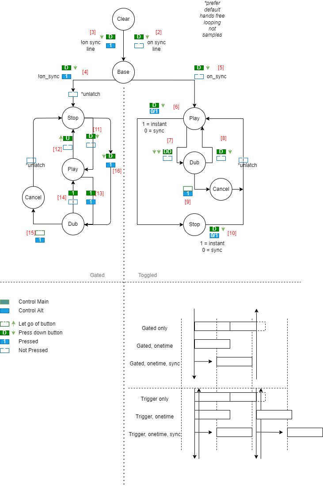

# M O T I F - MINIM *[Puredata implementation]*

This is a Puredata external set to make possible of looping several *motifs* togehter, mosically synced to beats, bars etc...

An simple patch could be wired up quickly to mimic a Boss RC-30 pedal for example, or the more complex RC-505.

The *motif* banks can either record audio in a loop form or a sample mode - both are identical in what they can do but differ in their behaviour when the user sends trigger signals.

The `[bank~]` object takes trigger signals in the form of an integer, not regular bangs, to simulate taking input from a button; this is done to detect if a button was double pressed or if the button was let go. This behaviour is transparent when mapped to a midi controller and feels very natural to use after some basic practice.

The `[mapper]` object helps with assigning physical midi controller buttons to feed straight into the `[bank~]` object.

The `[ticker]` object helps to synchronize multiple `[bank~]` objects so that polyphony can be achieved and maintained over time.

The `[plonk~]` object is available to use as a quick audiable metronome tick, useful for recording other *motifs* into `[bank~]` objects.

## Object parameters and symbols

### `[bank~]` :

The logic diagram below shows the distinct states each *motif* can be in at one time; the states are altered with trigger button commands, in combination with a shift button state:

