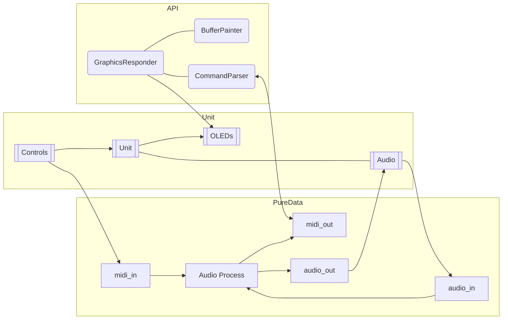

```mermaid
    graph LR;


    subgraph PureData
        dsp[Audio Process]
        midi_in --> dsp
        audio_in --> dsp
        dsp --> midi_out
        dsp --> audio_out
    end
    subgraph Unit
        unit
        ctrl
        displays
        audio
    end
    subgraph API
        gfx
        gfxClass
        cmdClass
    end

    gfx(GraphicsResponder)

    unit[[Unit]] --> displays[[OLEDs]] 
    ctrl[[Controls]] --> unit
    unit --- audio[[Audio]]

    audio_out --> audio
    audio --> audio_in

    gfx --- gfxClass(BufferPainter)
    gfx --- cmdClass(CommandParser)
    cmdClass <--> midi_out
    gfx --> displays

    ctrl --> midi_in

```